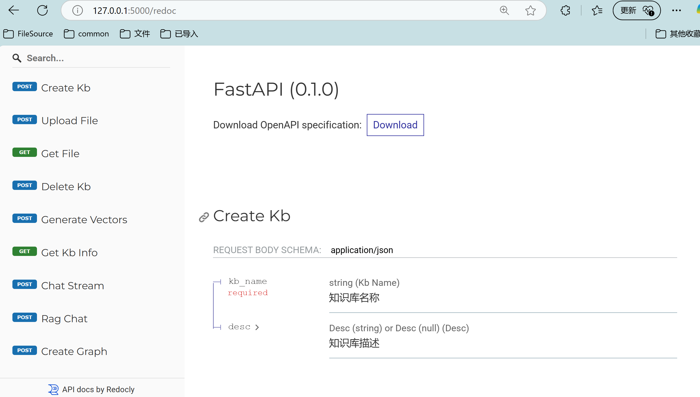

# langchain-graph-builder

[Chinese documentation](./README.md)

## Project Introduction

langchain-graph-builder is a backend service project built with FastAPI, designed to provide API support for the creation, management, and dialogue-related functions of knowledge bases. Through this project, users can conveniently create knowledge bases, upload files to knowledge bases, retrieve file content, delete knowledge bases, generate knowledge base file vectors, obtain knowledge base information, engage in large model stream dialogue, and RAG/GraphRAG dialogue, as well as create knowledge base graphs.

## Implemented Features

### 1. Knowledge Base

- Upload files to build a knowledge base

- Vectorization of knowledge bases

- Structured output from vector libraries to build knowledge graphs using large models
- Delete knowledge bases at different levels

### 2. Dialogue

- Stream dialogue

- RAG dialogue

- Internet parsing web dialogue

- GraphRAG dialogue

## Quick Start

### 1. Environment Configuration

```shell
git clone https://github.com/666xz666/langchain-graph-builder.git 
cd langchain-graph-builder

conda create -n lgb python=3.11 -y
conda activate lgb

pip install -r requirements.txt -i https://pypi.tuna.tsinghua.edu.cn/simple 
```

### 2. Copy Configuration File

```shell
python config_tool.py --copy
```

### 3. Configure Model

Configure the large model API key

Download the embedding model:

https://pan.baidu.com/s/1XKQfFnSLbF0AjTLy_BCeFQ?pwd=fkrv  

### 4. Configure Neo4j

Install Neo4j 5.21.0 and configure APOC

https://blog.csdn.net/m0_63593482/article/details/133096869 

### 5. Configure Path Information

Knowledge base storage directory, log directory, model path, etc.

### 6. Start the App

```shell
python app.py
```

## Documentation

After starting, you can view the documentation at `<host>:<port>/redoc`



## Q&A

### 1. “No module named pwd” (for Windows)

https://blog.csdn.net/qq_40821260/article/details/137644996
